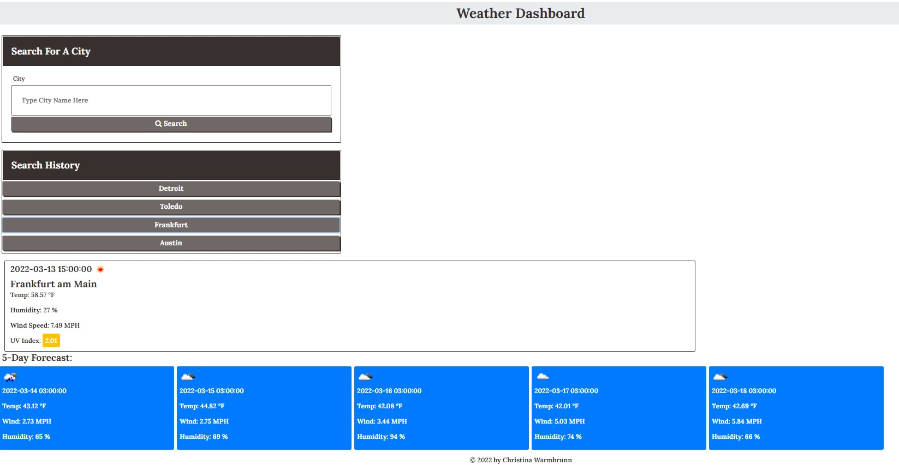
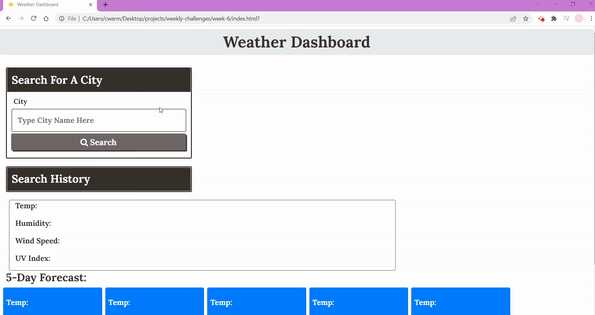

**Project Title:**

Weather Dashboard

---

**Project Description/Summary:**

Creating a weather dashboard with form inputs that displays the current and five-day forecast for various cities. When a user clicks on a city from their search history, the city information will re-load and display on the screen.

**Live Site:**

Head over to https://cwarmbrunn.github.io/weather-dashboard/ to view the page live!

---

**Technology Used:**

- OpenWeather One Call API
- Bootstrap
- jQuery
- JavaScript
- HTML
- CSS

---

**Installation:**

You can clone this repo - no special instructions to load this!

---

**Screenshot and GIF:**

